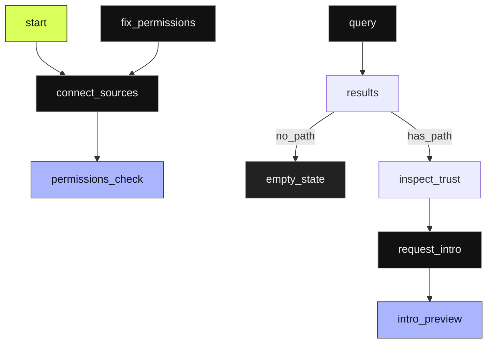

```mermaid
flowchart TD
classDef start fill:#d8ff5a,stroke:#333,color:#111;
classDef decision fill:#a9b6ff,stroke:#333,color:#111;
classDef hub fill:#a9b6ff,stroke:#333,color:#111;
classDef action fill:#111,stroke:#aaa,color:#eee;
classDef system fill:#111,stroke:#aaa,color:#eee;
classDef terminal fill:#222,stroke:#666,color:#eee;
classDef state fill:#111,stroke:#666,color:#eee;
start --> connect_sources
connect_sources --> permissions_check
fix_permissions --> connect_sources
query --> results
results -->|no_path| empty_state
results -->|has_path| inspect_trust
inspect_trust --> request_intro
request_intro --> intro_preview
class start start;
class connect_sources system;
class permissions_check decision;
class fix_permissions system;
class home hub;
class query action;
class results list;
class inspect_trust optional;
class request_intro action;
class intro_preview decision;
class sent terminal;
class empty_state terminal;
```
